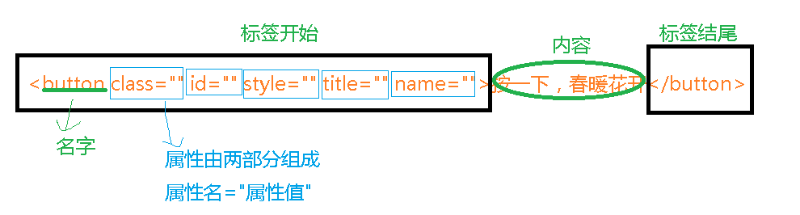

# 什么是jQuery？

 jQuery是一个快速，小型且功能丰富的JavaScript库。借助易于使用的API（可在多种浏览器中使用），使HTML文档的遍历和操作，事件处理，动画和Ajax等事情变得更加简单。兼具多功能性和可扩展性，jQuery改变了数百万人编写JavaScript的方式。 


### 库，框架：

​	指的是一堆方法的集合。每个方法都有自己独特的功能，本质上库或者框架能够对外提供很多的功能。

# 引入jquery

```
<script src="../../jquery.min.js"></script>

cdn：https://apps.bdimg.com/libs/jquery/2.1.4/jquery.min.js
```

# 窗体加载事件

```
$(function(){
	//窗体加载执行的代码
	alert(3)
})
```

# 选择器

jquery选择器有一个固定语法，$("选择器"),选择器一定要用$("")包起来。

选择器的内容：

### 基础选择器：

```
		*
​		tagname
​		.classname
​		#id
​		p,a
​		p a
​		p>a
​		p+a
​		P++a
​		p~a
```

### 数量选择器：

```
:first				第1个
:last				最后一个
:eq(1)				第2个
:eq(2)				第3个
:lt(2)				下标小于2的所有
:gt(2)				下标大于2的所有
:odd				奇数个
:even				偶数个q
```

### 属性选择器

```
[a]					包含a属性
[a=b]				a属性值为b
[a^=b]				a属性值以b开头
[a$=b]				a属性值以b结尾
[a~=b]				a属性的值包含b
[a][b]				同时包含a属性与b属性
[a!=b]				a属性的值不等于b
[a*=b]				a属性的值里面包含了字母b
```

### css3选择器

```
:first-child			$("p:first-child")			属于其父元素的第一个子元素的所有 <p> 元素
:first-of-type			$("p:first-of-type")		属于其父元素的第一个 <p> 元素的所有 <p> 元素
:last-child				$("p:last-child")			属于其父元素的最后一个子元素的所有 <p> 元素
:last-of-type			$("p:last-of-type")			属于其父元素的最后一个 <p> 元素的所有 <p> 元素
:nth-child(n)			$("p:nth-child(2)")			属于其父元素的第二个子元素的所有 <p> 元素
:nth-last-child(n)		$("p:nth-last-child(2)")	属于其父元素的第二个子元素的所有 <p> 元素，从最后一													个子元素开始计数
:nth-of-type(n)			$("p:nth-of-type(2)")		属于其父元素的第二个 <p> 元素的所有 <p> 元素
:nth-last-of-type(n)	$("p:nth-last-of-type(2)")	属于其父元素的第二个 <p> 元素的所有 <p> 元素，从最													  后一个子元素开始计数
:only-child				$("p:only-child")			属于其父元素的唯一子元素的所有 <p> 元素
:only-of-type			$("p:only-of-type")			属于其父元素的特定类型的唯一子元素的所有 <p> 元素
```

### 其他选择器：

```
:not()					反选，排除选择器
:visible				选择可见的
:hidden					选择隐藏的
:checked				选择所有勾选中的
:selected				选择所有拉选中的
:enabled				选择可操作的
:disabled				选择不可操作的
:empty					选择无内容的标签
:contains(text)			包含指定内容的标签
:has(a)					包含a子元素的标签					
:parent					选择有爹的孩子
:root					指的是html标签
:target					目标元素
```

### 表单选择器

```
:input			$(":input")		所有 input 元素
:text			$(":text")		所有带有 type="text" 的 input 元素
:password		$(":password")	所有带有 type="password" 的 input 元素
:radio			$(":radio")		所有带有 type="radio" 的 input 元素
:checkbox		$(":checkbox")	所有带有 type="checkbox" 的 input 元素
:submit			$(":submit")	所有带有 type="submit" 的 input 元素
:reset			$(":reset")		所有带有 type="reset" 的 input 元素
:button			$(":button")	所有带有 type="button" 的 input 元素
:image			$(":image")		所有带有 type="image" 的 input 元素
:file			$(":file")		所有带有 type="file" 的 input 元素
```

# 事件

jquery的事件跟js的事件其实是一毛一样的，只是绑定语法有些微的不同。

## 语法：

### 		绑定事件：

​				

```
			第一种绑定事件：		
					node
					.click(function(){
​							//点击事件的代码
​					})
					.mouseover(function(){
​						  //鼠标放上去事件的代码
​					})
			第二种绑定事件：
					node
					.bind("click",function(){
							//点击事件的代码
					})
					.bind("mouseout",function(){
							//点击事件的代码
					})
```

### 解绑事件：

```
$("button:eq(0)").unbind("click");
```

### 事件委托

```
$("#box").on("click","img",function(){
	$(this).remove();
})
```

## 常见事件：

| 鼠标事件                                                     | 键盘事件                                                     | 表单事件                                                  | 文档/窗口事件                                             |
| :----------------------------------------------------------- | :----------------------------------------------------------- | :-------------------------------------------------------- | :-------------------------------------------------------- |
| [click](https://www.runoob.com/jquery/event-click.html)      | [keypress](https://www.runoob.com/jquery/event-keypress.html) | [submit](https://www.runoob.com/jquery/event-submit.html) | [load](https://www.runoob.com/jquery/event-load.html)     |
| [dblclick](https://www.runoob.com/jquery/event-dblclick.html) | [keydown](https://www.runoob.com/jquery/event-keydown.html)  | [change](https://www.runoob.com/jquery/event-change.html) | [resize](https://www.runoob.com/jquery/event-resize.html) |
| [mouseenter](https://www.runoob.com/jquery/event-mouseenter.html) | [keyup](https://www.runoob.com/jquery/event-keyup.html)      | [focus](https://www.runoob.com/jquery/event-focus.html)   | [scroll](https://www.runoob.com/jquery/event-scroll.html) |
| [mouseleave](https://www.runoob.com/jquery/event-mouseleave.html) |                                                              | [blur](https://www.runoob.com/jquery/event-blur.html)     | [unload](https://www.runoob.com/jquery/event-unload.html) |
| [hover](https://www.runoob.com/jquery/event-hover.html)      |                                                              |                                                           |                                                           |

# dom操作

## 内容操作

```
使用html函数操作
    获取内容--如果node是一格数组，返回的即是数组第一个元素的内容 （能够获取到标签本身，比如p,span)
    let con = node.html()
    console.log(con);

    设置内容--可以设置html标签
    node.html("新的内容")		
    
使用text函数操作
	获取内容--如果node是一格数组，返回内容(没办法获取标签本身，只能获取内容)
	let con = node.text();
	console.log(con)
	
	设置内容--真的只能设置文本，哪怕给个标签，人家也是当文本
	node.text("文本内容")
```


## 属性操作



```
使用val函数操作属性---只能操作元素的value属性
    获取内容
    let val = node.val()
    console.log(val)

    设置内容
    node.val("内容")

使用attr函数来操作其他属性(包括value属性)
	获取属性内容
	let attr = node.attr("属性名字");
	console.log(attr)
	
	设置属性内容
	node.attr("属性名字","属性值")
	
	移除属性
	node.removeAttr("属性名")
```


## 样式操作

样式操作，主要是指操作style属性的值，还有一个就是操作class属性的值。

```
操作class
    增加class
    node.addClass("c1 c2")

    删除class
    node.removeClass("c1 c2")

    切换class   --有c1就删除c1，没有c1就新增c1
    node.toggleClass("c1")

    获取class
    node.attr("class")
    
操作style  --使用css函数来进行操作的
	设置单一样式
	node.css("样式名","样式值")
	
	设置多个样式
	node.css({"样式名":"样式值","样式名":"样式值"})
	
	获取样式
	let cs = node.css("样式名")
	console.log(cs);
```

## 增加

```
append()  - 在被选元素的最后一个子元素后面插入内容
prepend() - 在被选元素的第一个子元素之前插入内容
after()   - 在被选元素之后插入内容
before()  - 在被选元素之前插入内容
```


## 删除

```
node.remove()
```

## 尺寸

- width()								获取节点的宽度
- height()                              获取节点的高度
- innerWidth()                     获取节点的宽度（+内间距)
- innerHeight()                    获取节点的高度（+内间距)
- outerWidth()                     获取节点的宽度（+内间距+边框)
- outerHeight()                   获取节点的高度（+内间距+边框)

## 距离

+ node.offset().top			距离浏览器边缘的距离
+ node.position().top       距离父级定位元素的距离 

# 遍历

所谓遍历，其实就是选择了一个节点，通过这一个节点，找到他的"祖宗十八代"，即为遍历

## 父辈

```
parent()				他爸
parents()				他所有的父辈
parentsUntil("div")		找到div即停(不包含div本身)				
```

## 同辈

```
siblings()				所有的同辈
next() 					下一个兄弟
nextAll()				下面的所有兄弟
nextUntil("div")        找到div即停(不包含div本身)
prev() 					上一个兄弟
prevAll() 				上面的所有兄弟
prevUntil() 			找到div即停(不包含div本身)					
```

## 晚辈

``` 
children()				被选元素的所有直接子元素
children(p)				被选元素的所有直接p子元素
find(p)                 被选元素的后代元素，一路向下直到最后一个后代,所有后代p元素
```


## 过滤：

```
eq()                     $("p:eq(1)")  ==   $("p").eq(1)
first()                  $("p:first")  ==   $("p").first()        
last()
not()
filter()   				 在原有基础上过滤出符合要求的结果
```

# 动画

```
隐藏/显示
hide(时间，曲线，回调函数)		 		隐藏，时间单位是毫秒，曲线默认有linear，swing   
show(时间，曲线，回调函数)  				显示									
toggle(时间，曲线，回调函数) 				自动判断隐藏还是显示

淡入/淡出
fadeIn(时间，曲线，回调函数)				淡入
fadeOut(时间，曲线，回调函数)				淡出
fadeToggle(时间，曲线，回调函数)			自动判断淡入还是淡出
fadeTo(时间，透明度,曲线，回调函数)		  调整透明度到哪个位置

滑上/滑下
slideUp(时间，曲线，回调函数) 			上滑
slideDown(时间，曲线，回调函数) 			下滑
slideToggle(时间，曲线，回调函数) 		自动滑

动画(animate)
animate({params},speed,callback);

动画停止(stop)
stop(all,end)
stop()								停止当前动画，执行下一次动画
stop(true)							停止所有动画
stop(true,true)						停止所有动画，并且到达当前动画的结束点
```


# ajax

## 案例：

```
$.ajax({
				url:"./citys.js上,",
				type:"get",
				success:function(data){
					console.log(data);
				},
				error:function(){
					console.log("失败啦，哈哈哈");
				},
				dataType:"json"
			})
		})


```

## 参数详解

```
$.ajax()方法是jQuery最底层的Ajax实现。它的结构为：

　　$.ajax(options)

该方法只有一个参数，但是这个对象里包含了$.ajax()方法所需要的请求设置以及回调函数等信息，参数以key/value的形式存在，所有的参数都是可选的。常用参数见下表：

1.url

要求为String类型的参数，（默认为当前地址）发送请求的页面。

2.type		（post或get）默认为get。

3.timeout	 设置请求超时时间（毫秒）

4.async		所有请求均为异步请求。如果需要同步请求，请将此选项设置为false。

5.cache		要求为Boolean类型的参数，默认为true（当dataType为Script时，默认为false），设置false将不会从浏览器缓存中加载请求信息。

6.data

要求为Object或String类型的参数，发送到服务器的数据。如果不是字符串，将自动转换为字符串格式。get请求中将附加在URL后。防止这种自动转换，可以查看　　processData选项。对象必须为key/value格式，例如{foo1:"bar1",foo2:"bar2"}转换为&foo1=bar1&foo2=bar2。如果是数组，JQuery将自动为不同值对应同一个名称。例如{foo:["bar1","bar2"]}转换为&foo=bar1&foo=bar2。

7.dataType

要求为String类型的参数，预期服务器返回的数据类型。如果不指定，jQuery将自动根据HTTP包的mine信息返回responseXML或responseText，并作为回调函数参数传递。可用的类型如下：

　　xml：返回XML文档，可用jQuery处理。

　　html：返回纯文本HTML信息；包含的script标签会在插入DOM时执行。

　　script：返回纯文本javascript代码。不会自动缓存结果，除非设置了cache参数。注意在远程请求时（不在同一个域下），所有post请求都将转为get请求。

　　json：返回JSON数据。

　　jsonp:JSON格式。使用JSONP形式调用函数时，例如myurl?callback=?，JQuery将自动替换后一个“?”为正确的函数名，以执行回调函数。

　　text：返回纯文本字符串。

8.beforeSend

要求为Function类型的参数，发送请求前可以修改XMLHttpRequest对象的函数，例如添加自定义HTTP头。在beforeSend中如果返回false可以取消本次ajax请求。XMLHttpRequest对象是唯一的参数。

　　function(XMLHttpRequest){

　　　　this;//调用本次ajax请求时传递的options参数

　　}

9.complete

要求为Function类型的参数，请求完成后调用的回调函数（请求成功或失败均调用）。参数：XMLHttpRequest对象和一个描述成功请求类型的字符串。

　　function(XMLHttpRequest,textStatus){

　　　　this;    //调用本次ajax请求时传递的options参数

　　}

10.success

要求为Function类型的参数，请求成功后调用的回调函数，有两个参数。

　　（1）由服务器返回，并根据dataType参数进行处理后的数据。

　　（2）描述状态的字符串。

　　function(data,textStatus){

　　　　//data可能是xmlDoc、jsonObj、html、text等

　　　　this;    //调用本次ajax请求时传递的options参数

　　}

11.error

要求为Function类型的参数，请求失败时被调用的函数。该函数有3个参数，即XMLHttpRequest对象、错误信息、捕获的错误对象（可选）。ajax事件函数如下：

　　function(XMLHttpRequest,textStatus,errorThrown){

　　　　//通常情况下textStatus和errorThrown只有其中一个包含信息

　　　　this;    //调用本次ajax请求时传递的options参数

　　}

12.contentType

要求为String类型的参数，当发送信息至服务器时。内容编码类型默认为"application/x-www-form-urlencoded"。该默认值适合大多数应用场合。

13.dataFilter

要求为Function类型的参数，给Ajax返回的原始数据进行预处理的函数。提供data和type两个参数。data是Ajax返回的原始数据，type是调用jQuery.ajax时提供的dataTYpe参数。函数返回的值将由jQuery进一步处理。

　　function(data,type){

　　　　//返回处理后的数据

　　　　return data;

　　}

14.global

要求为Boolean类型的参数，默认为true。表示是否触发全局ajax事件。设置为false将不会触发全局ajax事件，ajaxStart和ajaxStop可用于控制各种ajax事件。

15.ifModified

要求为Boolean类型的参数，默认为false。仅在服务器数据改变时获取新数据。服务器数据改变判断的依据是Last-Modified头信息。默认值是false，即忽略头信息。

16.jsonp

要求为String类型的参数，在一个jsonp请求中重写回调函数的名字。该值用来替代在"callback=?"这种GET或POST请求中URL参数里的"callback"部分，例如{jsonp:'onJsonPLoad'}会导致将"onJsonPLoad=?"传给服务器。

17.username

要求为String类型的参数，用于响应HTTP访问认证请求的用户。

18.password

要求为String类型的参数，用于响应HTTP访问认证请求的密码。

19.processData

要求为Boolean类型的参数，默认为true。默认情况下，发送的数据将被转换为对象（从技术角度来讲而非字符串）以配合默认内容类型"application/x-www-form-urlencoded"。如果要发送DOM树信息或者其他不希望转换的信息，请设置为false。

20.scriptCharset

要求为String类型的参数，只有当请求时dataType为"jsonp"或者"script"，并且type是GET时才会用于强制修改字符集(charset)。通常在本地和远程的内容编码不同时使用。
```


